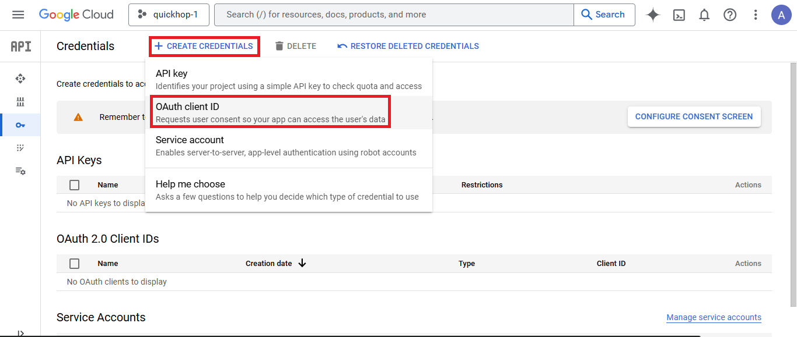
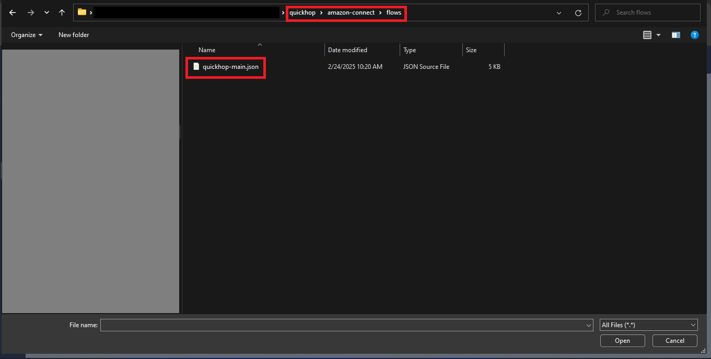

# 1. Overview
QuickHop is a web application that simplifies the work for recruiters and job seekers. It is integrated with Generative AI to match job seekers with job posts, conduct the phone screen calls (or interview calls), provide feedback on the CV for the job seeker, and create tailored resumes. Simply, the recruiter creates a new job post, then the system, using AI, checks every job seeker’s CV against the job post. When there is a match, a new opportunity would be shown for the job seeker’s interface as a card that includes a phone number. The job seeker can call the phone number to be connected to the AI at his or her convenient time (but before the job post’s end date) and answer the questions. When the job post’s end date is met or if the recruiter ended the job post manually, the recruiter could see the results of the job post which show all job seekers who made the interview call. The recruiters can select or exclude any job seeker who was matched by the AI and made the interview call. Also, they can listen to the recorded calls and download the tailored resumes. On the other hand, the job seeker can then see if he was selected or not as well as download his or her tailored resume. This section provides more details on the functionalities of recruiters, job seekers, and the AI in the system. The next section presents a guide on setting up and deploying resources. Finally, a step-by-step walkthrough of the system will be provided. 

## 1.1 Roles and Functionalities
There are three main roles: the Recruiter, the AI, and the Job Seeker.

### 1.1.1 Recruiter
- Creating a New Job Post
  - Entering the job title, job description, job responsibilities, required qualifications, and preferred qualifications.
  - Setting the minimum matching percentage used by the AI to calculate how closely a CV matches the job post.
  - Specifying the maximum number of interviewees. Once this number is reached, the system stops receiving interview calls, ensuring the recruiter does not see more candidates than this limit.
  - Defining the interview start and end dates to control how long the post accepts interview calls.
  - Including up to five predefined questions for the interview call. These questions can be manually entered or suggested by the AI.
- Checking Job Post Results
  - Viewing results when the job post due date is met for each candidate who made an interview call.
  - Downloading the job seeker's tailored resume.
  - Downloading the recorded calls.
  - Checking the interview call date.
  - Selecting or excluding the job seeker to provide the recruiter’s decision.

### 1.1.2 AI
- Matching each new job post with all existing job seekers’ CVs to determine if a CV meets the minimum matching percentage set by the recruiter.
- Conducting a phone screen interview with the job seeker using predefined questions approved by the recruiter.
- Generating a tailored resume, which can be downloaded by both the recruiter and the job seeker after the interview call.
- Providing feedback on each section of the CV to help job seekers improve their resumes. 

### 1.1.3 Job Seeker
- Creating a New CV
  - Receiving AI feedback on each section to help improve the content by suggesting additions or enhancements.
- Checking New Opportunities
  - Viewing job posts that match their CV.
  - Accessing relevant information needed to proceed with the interview call.
- Checking Interview Call Results
  - Viewing the recruiter’s decision, whether selected or excluded.
  - Downloading the tailored resume.


# 2. Multi-Cloud Resources Setup and Deployment
This project relies on various cloud resources, primarily from AWS, but it also utilizes Google Cloud, OpenAI services, and a domain registrar for managing DNS records (e.g., CNAME). The diagram below illustrates all the resources involved in this project.

<div align="center"></div>
<br />
The next subsections guide you through the requirements, configurations and deployment process.

## 2.1 Requirements
-	A custom domain is required with the capability to add DNS records.
-	An OpenAI account is needed to create and manage API keys.
-	Access to the Google Console is necessary to create and configure Google OAuth 2.0 Client IDs.
-	Administrator access to an AWS account is required, and the AWS CLI must be installed and configured on the local machine.
-	An Amazon Connect instance is needed, along with the ability to assign a phone number to flows in the Amazon Connect Admin Console.
-	Running bash scripts is necessary. On Windows, Git Bash should be installed, or the Windows Subsystem for Linux (WSL) should be enabled.

## 2.2 Non-AWS Resources Configurations
In this section, we will walk through the configurations for a domain registrar, OpenAI and Google Cloud.
1. Create CNAME records and configure subdomains.
   - Add two DNS records of type CNAME with placeholder values (to be updated later).  
    One will be used for the frontend and the other for the backend. In this example, the records are named `"frontend"` and `"backend"`, and the domain is `"infotechlab.online"`.   
    As a result, the two subdomains are:
      - https://frontend.infotechlab.online  
      -	https://backend.infotechlab.online  
  Screenshots from GoDaddy are provided, but this can be done with any domain registrar.

<div align="center"></div>
<br />
<div align="center"></div>
<br />  

2. Generate OpenAI Key. 
   - Create new OpenAI Key and take note of the key.

<div align="center"></div>
<br />

3. Create and configure a Google OAuth 2.0 Client ID.
   - Login to Google Cloud Console.
   -	From the Left Panel, select `"APIs & Services"` and then `"Credentials"`.
   -	Click on `"Create Credentials"`, then select `"OAuth Client ID"`.
   -	For Application Type, select `"Web Application"` and enter a name, such as `"TestQuickHop"`.
   -	Add Authorized JavaScript Origins as your client subdomain (e.g., https://frontend.infotechlab.online) and Authorized Redirect URIs as your server subdomain (e.g., https://backend.infotechlab.online).
   -	Make a note of your Google Client ID.

<div align="center"></div>
<br />
<div align="center"></div>
<br />
<div align="center"></div>
<br />
<div align="center"></div>
<br />

## 2.3 AWS Resources Configuration
You will need the following values for deployment: Certificate ARN, VPC and subnet IDs, S3 bucket name, EC2 AMI ID, Key Pair's name, Amazon Connect recorded calls path, and a phone number. This section provides the required steps to obtain these values.
1. Get the Certificate ARN from ACM.
   - Open the AWS Certificate Manager Console.
   - Request a new public certificate.
   - Enter your domain.
   - Copy the NAME and VALUE to be added as new CNAME record in your domain registrar.
   - Ensure the certificate status changes to `"Issued"`.
   - Copy the certificate ARN for later use.

<div align="center"></div>
<br />
<div align="center"></div>
<br />
<div align="center"></div>
<br />
<div align="center"></div>
<br />
<div align="center"></div>
<br />
<div align="center"></div>
<br />
<div align="center"></div>
<br />

2. Obtain VPC and subnets IDs.
   - Open the VPC Console.
   - Select `"Your VPCs"` from the left panel (under the region you will use).
   - Take note of the VPC ID.
   - Navigate to the `"Subnets"` Section from the left panel.
   - Take note of the IDs of two subnets that are from different Availability Zones.
   - Ensure the VPC has at least two subnets in different Availability Zones with Internet access. 

<br />
<div align="center"></div>
<br />
<div align="center"></div>
<br />

3. Create an S3 bucket with its default settings. Take note of the bucket name.

<br />
<div align="center"></div>
<br />

4. Take note of the EC2 AMI ID that is compatible for your region and uses Ubuntu OS.
   - Open the EC2 console.
   - Click on `"Launch instances"` in the `"Instances"` section.
   - Under `"Application and OS Images (Amazon Machine Image)"`, select Ubuntu OS.
   - Take note of the `"AMI ID"`.
   - Note: The AMI ID can be different from one region to another. Therefore, copy the AMI ID that is compatible  for the region you will use for this project.

<br />
<div align="center"></div>
<br />

5. Create key pair and save its name.
   - In the EC2 console, click on `"Key Pairs"` under `"Network & security"`.
   - Click on `"Create key pair"`.
   - Enter a name and take note of this name.
   - Leave the type as `"RSA"`.
   - Select `".pem"` file format for OpenSSH. You will use this file to access EC2 servers later.
   - Click on `"Create key pair"`.

<br />
<div align="center"></div>
<br />
<div align="center"></div>
<br/>

6. Get the recorded calls path.
   - Open Amazon Connect console.
   - Select your instance.
   - Click on `"Data storage"` from the left panel.
   - Under call recordings section, click on `"Edit"`.
   - Check the `"Enable call recording"` checkbox.
   - Select `"Select an existing S3 bucket"`.
   - Under the `"Name"` drop list, select the bucket that you created earlier.
   - Click save.
   - Take note of the recorded calls path without the bucket name and by adding `"/ivr/"` as a suffix.

<div align="center"></div>
<br />
<div align="center"></div>
<br />
<div align="center"></div>
<br />

7. Assign a phone number to any IVR flow.
   - Open your Amazon Connect Admin Console.
   - Assign a phone number to any flow you have (you will update it later).
   - Take note of the phone number.

<div align="center"></div>

## 2.4 Project Deployment
1. Update the CloudFormation parameters and run the stack.  
   - Clone the project and change the directory to `"cloudformation-IaC"`.   
   - Rename the `"parameters-template-only.json"` to be exactly as `"parameters.json"`.   
     ```bash
     $ git clone https://github.com/alialjohani/quickhop.git
     $ cd quickhop/cloudformation-IaC/
     $ mv parameters-template-only.json parameters.json
     ```
     
   - Change the values of `"parametervalue"` in the `"parameters.json"` file using the noted values from previous steps. The following table presents all the parameters’ keys and values that you will need to change.  

    | **Parameter Key**         | **Parameter Value**                                                                                       |
    |----------------------------|----------------------------------------------------------------------------------------------------------|
    | **awsRegion**              | Add the AWS region value where your existing resources are located and where the new resources will be created (e.g., `"us-east-1"`).                        |
    | **awsS3BucketName**        | Enter the bucket name (e.g., `"quickhop-test-01"`).                                                         |
    | **awsS3RecordingPrefix**   | Enter the recorded calls path from the data storage in your Amazon Connect console. <br>The path must be without the bucket name, and you must add this suffix `"/ivr/"` (e.g., `"connect/quickhopconnect/CallRecordings/ivr/"`). |
    | **awsKeyPair**             | Enter the keypair name (e.g., `"quickhop_keypair"`).                                                      |
    | **ec2InstanceImageId**     | Enter the AMI ID for Ubuntu OS suitable for your region (e.g., `"ami-04b4f1a9cf54c11d0"`).                  |
    | **VPC**                    | Enter the VPC ID in your region (e.g., `"vpc-123456789abcndkfo"`).                                          |
    | **Subnet1**                | Enter a subnet ID in your region with Internet access (e.g., `"subnet-123456789abcndkfo"`).                 |
    | **Subnet2**                | Enter a second subnet ID in a different Zone than the previous one, in the same region with Internet access (e.g., `"subnet-987654321ofkdncba"`). |
    | **SSLCertificateArn**      | Enter your certificate ARN (e.g., `"arn:aws:acm:us-east-1:796973505888:certificate/db7e999e-ee2a-4b95-ba6d-9711592f64ea"`). |
    | **backendBaseUrl**         | Enter your backend subdomain with the `"api"` suffix (e.g., "`https://backend.infotechlab.online/api"`).          |
    | **allowedOrigin**          | Enter your frontend subdomain (e.g., `"https://frontend.infotechlab.online"`).                              |
    | **cognitoUserPoolDomain**  | Enter a name for your Cognito user pool domain. It must be unique (e.g., `"quickhop"`).                     |
    | **cognitoRedirectUri**     | Enter your frontend subdomain with `"/callback"` as suffix (e.g., `"https://frontend.infotechlab.online/callback"`). |
    | **googleClientId**         | Enter your Google Client ID (e.g., `"123456789123-hgbd4v200ab612343z46r12345678abc.apps.googleusercontent.com"`). |
    | **openaiApiKey**           | Enter your OpenAI key (e.g., `"3yASVO1f63EwbecaNsT7jyceQSfso5jhafjoTyGGISRj5F7Wcm27-DEgILKPv22H0cTPz0Et-vCLEEBPpdv6OXTRX5LUYsSGWBX5kJfo5LMAamhq5DAMd8p"`). |
    | **openaiModel**            | Leave this as `"gpt-4o"` model.                                                                             |
    | **dbIdentifier**           | Enter an identifier name for your database ensuring it meets AWS naming restrictions (e.g., `"quickhopidentifier"`).                                 |
    | **dbName**                 | Enter your database name ensuring it meets AWS naming restrictions (e.g., `"quickhopdb"`).                                                           |
    | **dbUser**                 | Enter a username for the database ensuring it meets AWS naming restrictions (e.g., `"quickhobdbadmin"`).                                              |
    | **recruitmentPhone**       | Enter the phone number including the country code and without spaces (e.g., `"+15067016666"`).              |  

   - In `"quickhop/cloudformation-IaC"`, run the `"deploy.sh"` script to create the stack in CloudFormation.      
     
     ```bash
     $ ./deploy.sh 
     ```

    
2. Update CNAME records.
   - Open the CloudFormation console and click on `"Stacks"`.
   - Click on the nested stack that starts with `"quickhop-stack-LoadBalancerResources-"`.
   - Click on the `"Outputs"` tab.
   - Copy the values for the frontend and backend URLs.
   - Open your domain registrar.
   - Replace the placeholder value in your frontend CNAME record with the copied frontend URL.
   - Replace the placeholder value in your backend CNAME record with the copied backend URL.

<div align="center"></div>
<br/>
<div align="center"></div>
<br/>
<div align="center"></div>
<br/>

3. Add Lex and Lambda resources to your Amazon Connect.
   - Open the Amazon Connect console.
   - Select your instance.
   - Click on `"Flows"` from your left panel.
   - Under `"Amazon Lex"`:
     - Select your region.
     - Select the bot `"QuickHopBot"`.
     - Select `"QuickHopLiveAlias"` for the `"Alias"`.
     - Click on `"+ Add Amazon Lex Bot"`.
   - Under `"AWS Lambda"`:
     - Select `"quickhop-connect-getCallerInfoByJobMatchingId"` lambda.
     - Click on `"+ Add Lambda Function"`.

<div align="center"></div>
<br />
<div align="center"></div>
<br />
<div align="center"></div>
<br />

4. In the Amazon Connect Admin Console, upload, edit, save, and publish the IVR modules and flows, then assign the phone number to the `"quickhop-main"` flow.  
   - Open `"Flows"` page in the console.  
   - Select the `"Modules"` tab.  
   - Click on `"Create flow module"`.  
   - Click on `"Import"`, and then `"Choose file"`.  
   - Upload the `"quickhop-GetAndCheckCaller.json"` from `"quickhop/amazon-connect/modules"` folder. Then, click `"Import"`.  
   - Once the module is imported, edit `"GetCallerFromDynamoAndCheck"` block, and select the `"quickhop-connect-getCallerInfoByJobMatchingId"` lambda, and save the block.  
   - Click on `"Save"` then on `"Publish"`.
   <br />  
   <div align="center"></div>  
   <br />  
   <div align="center"></div>  
   <br />  
   <div align="center"></div>  
   <br />  
   <div align="center"></div>  
   <br />  
   <div align="center"></div>  
   <br />  
   <div align="center"></div>  
   <br />  

   - Again, open `"Flows"` page in the console.  
   - Select the `"Modules"` tab.  
   - Click on `"Create flow module"`.  
   - Click on `"Import"`, and then `"Choose file"`.  
   - Upload the `"quickhop-module-Lex-Lambda-OpenAI.json"` from `"quickhop/amazon-connect/modules"` folder. Then, click `"Import"`.  
   - Once the module is imported, edit `"Lex_With_LLM"` block, and select the `"QuickHopBot"` and `"QuickHopLiveAlias"` under `"Lex Bot"` section.  
   - Save the block.  
   - Click on `"Save"` then on `"Publish"` to publish the module.  
   <br />  
   <div align="center"></div>  
   <br />  
   <div align="center"></div>  
   <br />  
   <div align="center"></div>  
   <br />  
   <div align="center"></div>  
   <br />  

   - One last time, open `"Flows"` page in the console.
   - Select the `"Flows"` tab.
   - Click on `"Create flow"`.
   - Click on `"Import"`, and then `"Choose file"`.
   - Upload the `"quickhop-main.json"` from `"quickhop/amazon-connect/flows"` folder.
   - Then, click `"Import"`.
   - Once the module is imported, edit `"GetAndCheckCallerInfoForJobPosting"` block, and select the `"quickhop-GetAndCheckCaller"` module under `"Module name"` section.
   - Save the block.
   - Also, edit `"OpenAI"` block, and select the `"quickhop-module-Lex-Lambda-OpenAI"` module under `"Module name"` section.
   - Save the block.
   - Click on `"Save"` then on `"Publish"` to publish the module.
   <br />  
   <div align="center"></div>  
   <br />  
   <div align="center"></div>  
   <br />  
   <div align="center"></div>  
   <br />  
   <div align="center"></div>  
   <br />  
   <div align="center"></div>  
   <br />  
   <div align="center"></div>  
   <br />  

   - Finally, reassign the phone number to `"quickhop-main"` flow.
   <br />  
   <div align="center"></div>  
   <br />  
   <div align="center"></div>  
   <br />  

5. Create a recruiter account by accessing the backend EC2 server.
   - Open EC2 console.
   - Click on `"Instances"` from the left panel.
   - Select the `"BackendAppEC2Instance"` instance.
   - Click on `"Connect"` button.
   - Select `"SSH client"` tab.
   - Copy the `"Example"` command that will be provided.

   <br />  
   <div align="center"></div>  
   <br />  
   <div align="center"></div>  
   <br />  

   - In your CLI, paste the command. Make sure you are in the same directory as your keypair `".pem"` file, or update the command with the correct path by adding the full directory path to the `".pem"` file.   

     ```bash
     $ ssh -i "quickhop_keypair.pem" ubuntu@ec2-54-237-227-127.compute-1.amazonaws.com
     ```  

   - Switch to root user and change your path to the home directory.
   - Edit `"Create_Company_Recruiter.sh"`.   

     ```bash
     $ sudo su
     ~# cd ~
     ~# nano Create_Company_Recruiter.sh
     ```  

   - Enter any email and password. Ensure the email is in a valid format (e.g., example@example.com) and the password meets the required criteria.
   - Copy Cognito `"UserPoolID"` from the CloudFormation stack `"quickhop-stack-CognitoResources-"` from `"Outputs"` tab and paste it as a value for `"COGNITO_User_pool_ID"`.

   <br />  
   <div align="center"></div>  
   <br />  
   <div align="center"></div>  
   <br />  

   - Exit and save the file.
   - Run the script.

       ```bash
       ~# ./Create_Company_Recruiter.sh
       ```


   <br />    
   <div align="center"></div>  
   <br />  

**Note:** After deleting the CloudFormation stack and once all resources are removed, make sure to delete your bucket, any snapshots taken for the RDS DB (if they exist), the logs in CloudWatch log groups, and release the phone number in the Amazon Connect Admin Console.

# 3. Walkthrough of the System
1. Open your browser and navigate to the web app using the frontend subdomain URL (e.g., https://frontend.infotechlab.online).
2. Login as job applicant and create a CV, as shown in next images.
<br />  
<div align="center"></div>  
<br />
<div align="center"></div>
<br />
<div align="center"></div>
<br />
<div align="center"></div>
<br />
<div align="center"></div>
<br />
<div align="center"></div>
<br />
<div align="center"></div>
<br />
<div align="center"></div>
<br />
<div align="center"></div>
<br />
<div align="center"></div>
<br />

3. Login as recruiter and create new job post, as shown below.

<div align="center"></div>
<br />
<div align="center"></div>
<br />
<div align="center"></div>
<br />
<div align="center"></div>
<br />
<div align="center"></div>
<br />
<div align="center"></div>
<br />
<div align="center"></div>
<br />
<div align="center"></div>
<br />
<div align="center"></div>
<br />
<div align="center"></div>
<br />

4. After you create the job post, on the `"All Job Posts"` page, the status of the newly created job post is presented. Note that the recruiter can check the results of the job post only when the job post is in the `"Completed"` status.

<div align="center"></div>
<br />
<div align="center"></div>
<br />
<div align="center"></div>
<br />

5. In the job applicant interface, the job seeker can find all the job posts that match his or her skills and experience under the `"New Opportunities"` page. Then, the job seeker must call the provided phone number and answer the interview questions to be considered for the position.

<div align="center"></div>
<br />

6. In the job applicant interface, the job seeker can check the results after making the interview call on the `"Interview Results"` page.

<div align="center"></div>
<br />

7. In the recruiter interface, the recruiter can find all job seekers who were matched and made the interview calls by clicking on the "Results" button when the job post is in the `"Completed"` status. Then, the recruiter can download the tailored resume and the recorded call.

<div align="center"></div>
<br />
<div align="center"></div>
<br />
<div align="center"></div>
